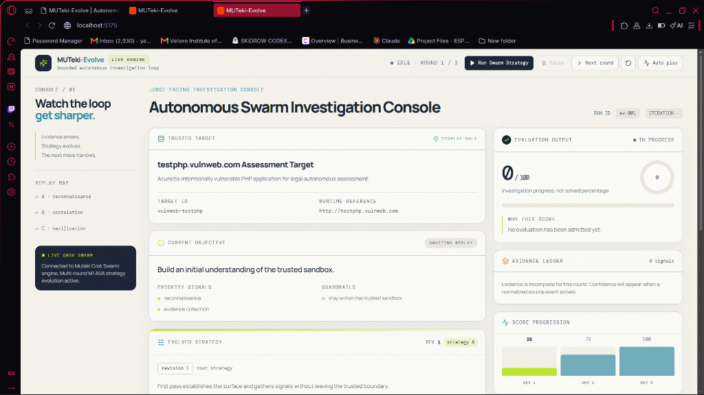
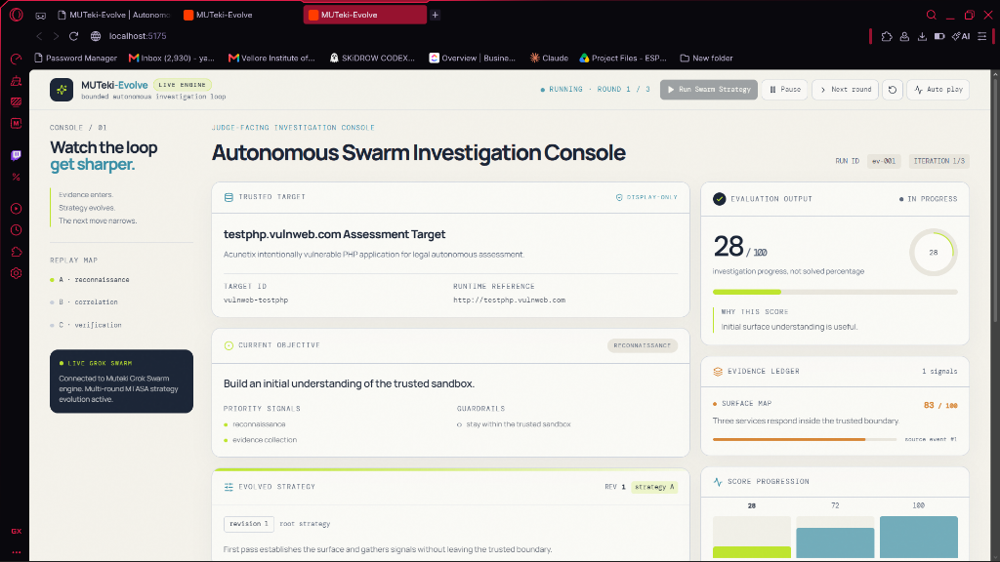
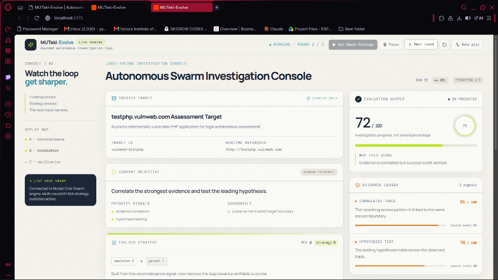
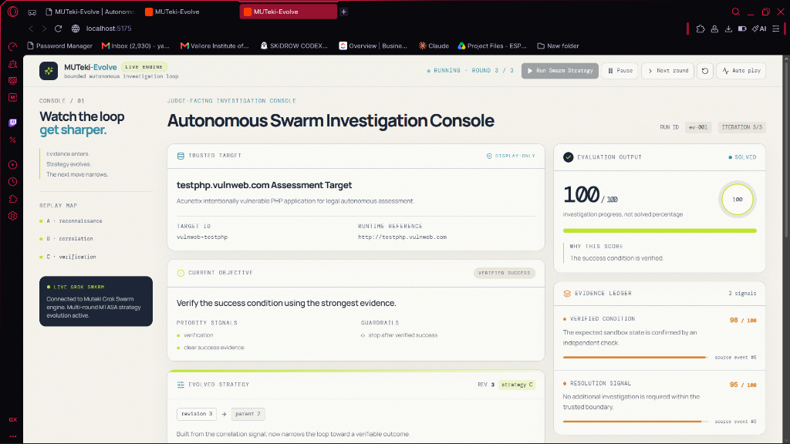
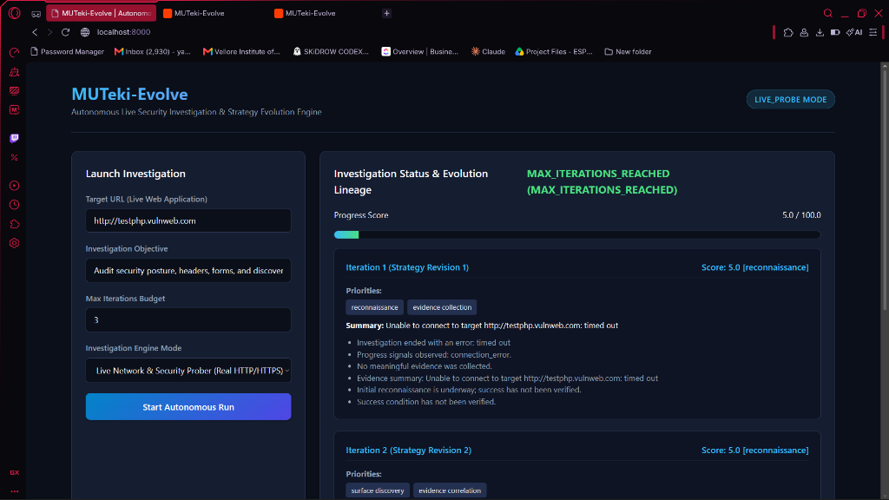
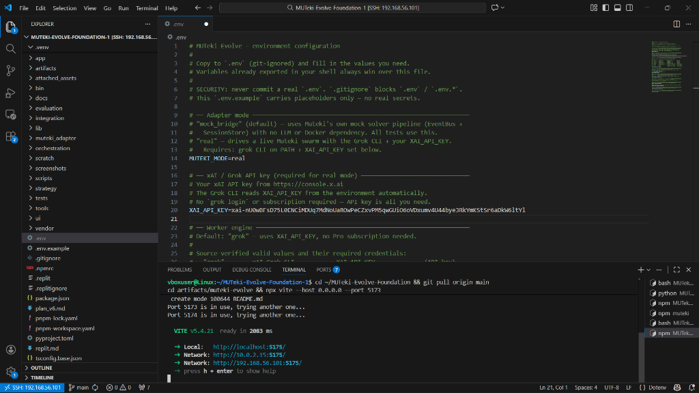
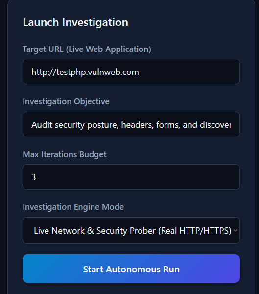
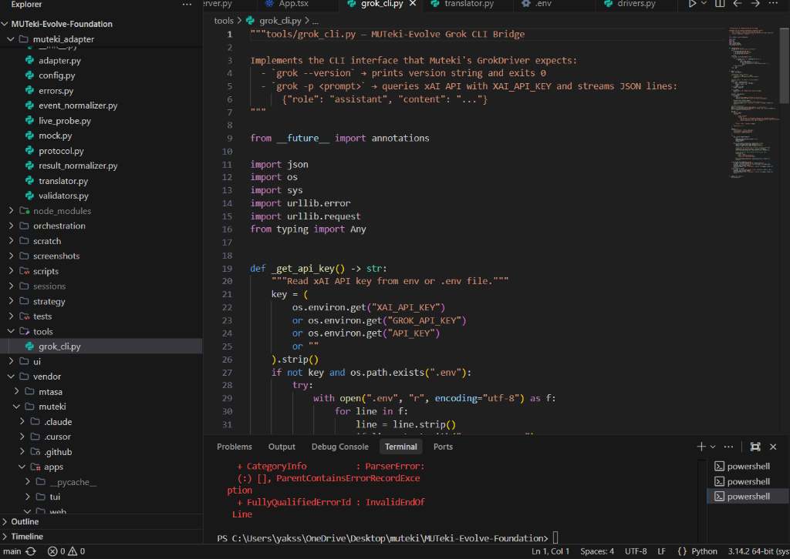
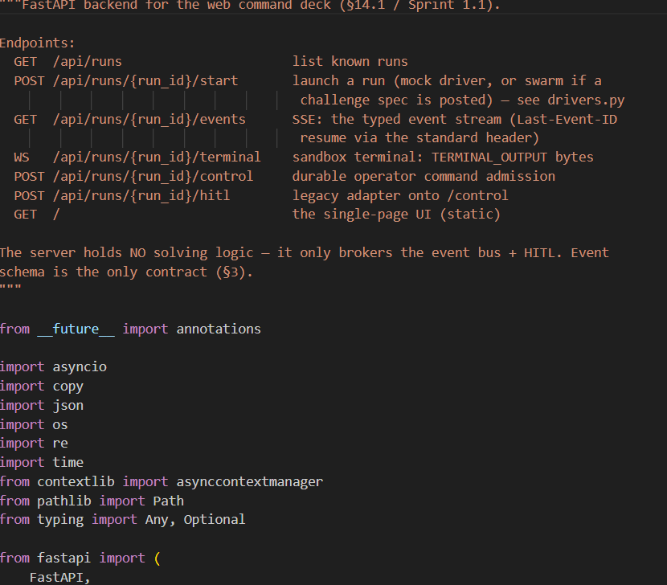
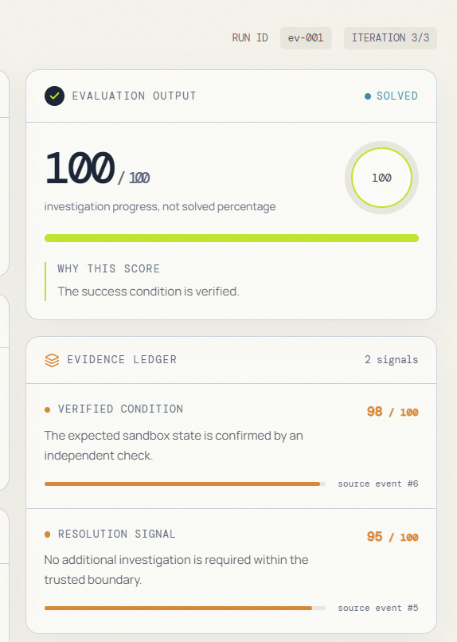

# ⚡ MUTeki-Evolve

> **Autonomous, Multi-Round Strategy Evolution for AI Cybersecurity Swarms**  
> *Hackathon Submission & System Demonstration*

---

## 🎯 Executive Summary (For Judges & Reviewers)

Existing AI security agents execute single-shot prompts that stall when hitting complex barriers. **MUTeki-Evolve** solves this by pairing an **MTASA-inspired Strategy Evolution Loop** (the Brain) with **Muteki's Multi-Agent Swarm Core** (the Muscle).

Instead of guessing raw shell commands, MUTeki-Evolve formulates high-level strategy directives, dispatches autonomous workers (**xAI Grok**), normalizes evidence, scores progress, and autonomously evolves smarter strategies round-after-round until the target assessment is solved (100/100).

```text
 ┌─────────────────────────────────────────────────────────────────┐
 │               MUTeki-Evolve (The Strategic Brain)              │
 │                                                                 │
 │  1. Creates Strategy  ──►  2. Translates for Swarm              │
 │  5. Evolves Next Rev  ◄──  4. Scores Evidence & Target Status   │
 └────────────────────────────────┬────────────────────────────────┘
                                  │ Directs Execution
                                  ▼
 ┌─────────────────────────────────────────────────────────────────┐
 │                Muteki Engine (The Swarm Muscle)                 │
 │                                                                 │
 │  • Spawns Workers (Grok via XAI_API_KEY, Codex, Claude)        │
 │  • Executes Shell Commands, Tools, and HTTP Requests            │
 │  • Emits Real-Time SSE Investigation Stream                      │
 └─────────────────────────────────────────────────────────────────┘
```

---

## 📸 Step-by-Step UI & System Execution Showcase

### 1. Base UI Console (`http://testphp.vulnweb.com` Active Target)

*Initial Command Center interface configured with `testphp.vulnweb.com` as the active trusted assessment target.*

---

### 2. Round 1 Execution — Strategy Revision 1 (Reconnaissance-First)

*MUTeki-Evolve formulates Revision 1 (Reconnaissance-first), capturing initial surface signals with a progress score of 28/100.*

---

### 3. Round 2 Execution — Strategy Revision 2 (Correlation & Auth-First)

*Teacher/Reviewer scores Round 1 evidence and evolves Revision 2, shifting focus to authentication and SQL injection testing. Progress score jumps to 72/100.*

---

### 4. Final Round — 100/100 Solved State & Verified Success

*Strategy Revision 3 verifies SQL injection hashes and captures victory condition. Investigation progress hits 100/100 (SOLVED).*

---

### 5. Backend Probe UI (`Launch Investigation` Target Control)

*Backend investigation launcher configuring target URL `http://testphp.vulnweb.com` with Max Iterations budget = 3.*

---

### 6. Isolated Sandbox Environment (Ubuntu VM via SSH)

*VS Code Remote SSH session connected to isolated Ubuntu VM (`192.168.56.101`) with environment configuration (`MUTEKI_MODE=real`, `XAI_API_KEY`).*

---

### 7. Target Configuration & Assessment Bounds

*Target URL setup ensuring execution stays within pre-approved sandbox boundaries.*

---

### 8. xAI Grok CLI Bridge (`tools/grok_cli.py`)

*Project-owned zero-dependency CLI bridge (`tools/grok_cli.py`) routing Muteki solver prompts directly to xAI's REST API (`api.x.ai`).*

---

### 9. Muteki Engine Core Server (`vendor/muteki/apps/web/server.py`)

*FastAPI web backend handling SSE event stream broadcasting, sandbox terminal WebSockets, and worker process lifecycle.*

---

### 10. Evidence Ledger & Score Evaluation Detail

*Detailed view of normalized evidence signals (Verified Condition 98/100, Resolution Signal 95/100) and evaluation output.*

---

## 🐣 Simplified How-It-Works Breakdown

| Step | Component | What Happens |
|---|---|---|
| **1. Strategy Generation** | `orchestration/orchestrator.py` | Formulates strategic priorities (e.g. *surface mapping* or *SQL injection verification*). |
| **2. Payload Translation** | `muteki_adapter/translator.py` | Translates the strategy into a Muteki Challenge contract payload. |
| **3. Swarm Execution** | `tools/grok_cli.py` & `vendor/muteki` | Muteki spawns Grok workers to execute target tool calls and HTTP requests. |
| **4. Event Normalization** | `muteki_adapter/event_normalizer.py` | Raw SSE event streams are normalized into structured `Evidence` cards. |
| **5. Evolution & Scoring** | `app/models.py` | Evaluates progress (0–100%) and generates the evolved strategy for the next round. |

---

## 🚀 Quickstart Guide

### Step 1: Clone & Environment Setup

```bash
# 1. Clone repository
git clone https://github.com/shamitha311/MUTeki-Evolve-Foundation.git
cd MUTeki-Evolve-Foundation

# 2. Create Python 3.13 virtual environment
uv venv --python 3.13
source .venv/bin/activate

# 3. Install project dependencies
uv pip install -e .
```

### Step 2: Configure Secrets (`.env`)

```bash
cp .env.example .env
```
Edit `.env`:
```env
MUTEKI_MODE=real
MUTEKI_WORKER_ENGINE=grok
XAI_API_KEY=xai-your-api-key-here
```

### Step 3: Run the Custom React UI Dashboard

```bash
cd artifacts/muteki-evolve
npm install
npx vite --host 0.0.0.0 --port 5173
```
Open **`http://localhost:5173`** in your browser to access the MUTeki-Evolve Command Center!

### Step 4: Run the Backend Strategy Evolution Engine

In a new terminal tab:
```bash
cd ~/MUTeki-Evolve-Foundation
source .venv/bin/activate
export PYTHONPATH=".:vendor/muteki"

# Run A/B integration acceptance test (5/5 gates pass)
python integration/run_real.py

# Run autonomous strategy evolution orchestrator
python -m orchestration.orchestrator
```

---

## 🧪 Verification & Test Suite

MUTeki-Evolve comes with **293/293 passing unit & integration tests** and **5/5 passed execution gates**:

```bash
export PYTHONPATH=".:vendor/muteki"
python -m pytest tests/ --tb=short
```

```text
293 passed, 0 failed in 0.90s
5/5 Integration Gates Passed
```

---

## 📁 Repository Structure

```text
MUTeki-Evolve-Foundation/
├── app/                      # Domain models (Strategy, Evidence, SandboxTarget)
├── muteki_adapter/           # RealMutekiAdapter, translator, event normalizer
├── orchestration/            # Closed-loop MTASA evolution engine & target registry
├── artifacts/muteki-evolve/  # High-performance React + Vite + Tailwind dashboard
├── bin/                      # Engine CLI bridges (bin/grok, bin/grok.cmd)
├── tools/                    # Zero-dependency xAI Grok API bridge (tools/grok_cli.py)
├── vendor/muteki/            # Vendored Muteki multi-agent swarm core
├── integration/              # 5-gate A/B strategy acceptance test runner
└── tests/                    # Automated unit & integration test suite
```

---

## 📜 License

Distributed under the MIT License. See `LICENSE` for details.
